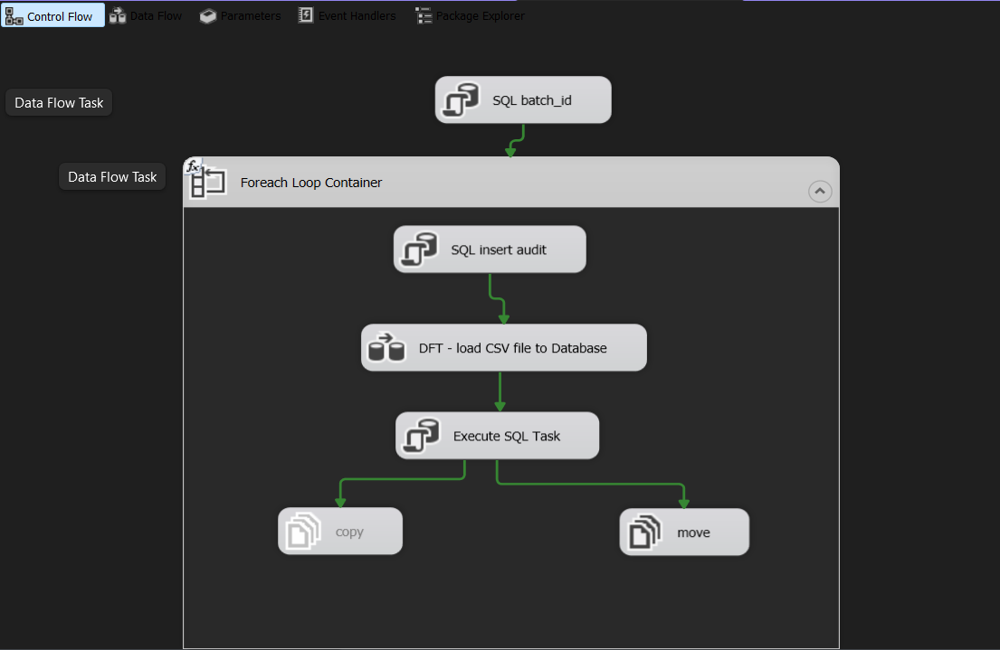
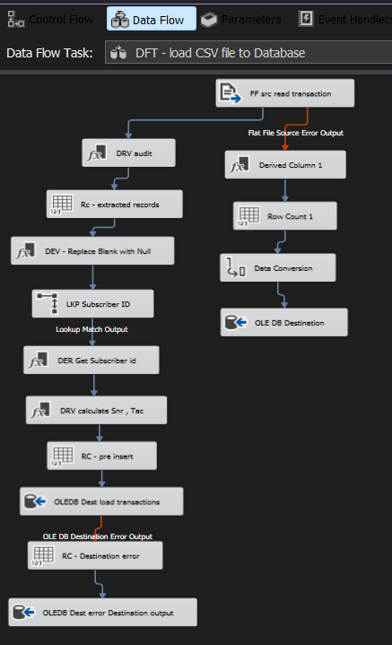
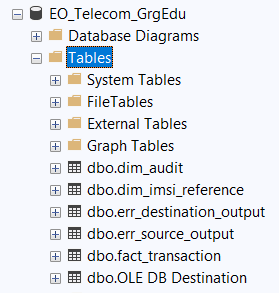
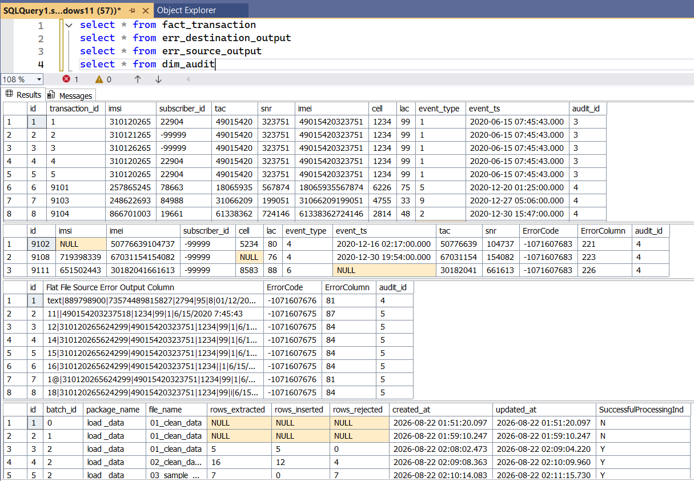

# 📡 Telecom ETL Data Integration Project
An end-to-end ETL pipeline built with SQL Server Integration Services (SSIS) to ingest telecom transaction data from CSV files, clean and enrich the data, load it into a relational database, and maintain audit/error tracking.

# 📌 Project Overview:
This project implements a Telecom Data Warehouse ETL pipeline using Microsoft SQL Server Integration Services (SSIS).
The pipeline is designed to process telecom transaction files in batch form and transform raw CSV data into structured database records.

The main workflow is:

CSV Files
   │
   ▼
Flat File Source
   │
   ▼
Data Cleaning & Data Conversion
   │
   ├── Replace blank values with NULL
   ├── Convert data types
   ├── Generate TAC & SNR from IMEI
   └── Add Audit ID
   │
   ▼
Lookup Subscriber ID
   │
   ▼
Data Validation & Row Counting
   │
   ├──────────────► Error Records
   │
   ▼
Fact Transaction Table
   │
   ▼
Audit Update
   │
   ▼
Archive / Move Processed Files

# 🎯 Project Objectives:
The project focuses on building a reliable ETL process capable of:
📥 Reading telecom transaction data from CSV files.
🧹 Cleaning and standardizing incoming data.
🔄 Converting source data into the required data types.
🔎 Enriching transactions using subscriber reference data.
🧩 Deriving additional telecom attributes such as TAC and SNR from IMEI.
🗄️ Loading valid records into a SQL Server fact table.
⚠️ Redirecting rejected records to an error table.
📊 Tracking extracted, inserted, and rejected row counts.
📝 Maintaining batch-level and file-level audit information.
📦 Moving/copying processed source files as part of the ETL workflow.

# 🛠️ Technologies Used:
Technology
Purpose
SQL Server Integration Services (SSIS)
ETL development and orchestration
Microsoft SQL Server
Target database
T-SQL
SQL queries, audit operations, and database processing
CSV / Flat Files
Source data
OLE DB
Database connectivity
SSIS Data Flow
Data transformation and loading

# 🗂️ Project Structure

Telecom project 3/
│
├── Telecom project 3.dtproj
├── Telecom project 3.database
├── Project.params
│
├── load _data.dtsx
├── load _data 1.dtsx
├── load_data2.dtsx
│
├── bin/
│   └── Development/
│       └── Telecom project 3.ispac
│
└── obj/
    └── Development/
        ├── BuildLog.xml
        ├── Project.params
        └── Telecom project 3.dtproj

Main SSIS Packages
load _data.dtsx
The main ETL package.

## It contains:
SQL batch ID generation
Foreach Loop Container
File copy/move operations
Data Flow Task
Audit record insertion
Audit record update
Error handling
Row counting
load _data 1.dtsx

## A simplified data-flow package containing:
Flat File Source
Derived Column transformation
Multicast
load_data2.dtsx
Included as part of the SSIS project structure.

# 🔄 ETL Pipeline Details

## 1. 📥 Source Extraction
The pipeline reads telecom transaction data from a delimited CSV file.
The source contains fields such as:

id
imsi
imei
cell
lac
event_type
event_ts

The source file is configured as a flat-file connection and uses a delimiter-based structure.

## 2. 🧹 Data Cleaning:
The package contains a dedicated transformation:
DEV - Replace Blank with Null
This step handles missing or blank values before loading them into the database.

##Examples include:
Blank imsi → NULL
Blank imei → NULL
Zero/invalid cell → NULL
Zero/invalid lac → NULL
Blank event_type → NULL
Missing event_ts → NULL
This improves data quality and prevents invalid placeholder values from being inserted into the target tables.

## 3. 🔄 Data Conversion
The Data Conversion transformation prepares incoming fields for the data types expected by SQL Server.
This creates a consistent schema between the raw CSV source and the database destination.

## 4. 🔎 Subscriber Lookup
The package uses a Lookup Transformation named:
LKP Subscriber ID
The lookup uses the reference table:
dbo.dim_imsi_reference

## The matching key is:
imsi
The lookup retrieves:
subscriber_id
This enriches the raw telecom transaction with the corresponding subscriber identifier.
If no subscriber is found, the flow handles the missing match using a default value rather than allowing the record to silently disappear.

## 5. 🧩 TAC & SNR Calculation
The transformation:
DRV calculate Snr , Tac
derives additional information from the IMEI.
The logic extracts parts of the IMEI to generate:
TAC
SNR
Invalid or missing IMEI values are handled using a fallback value:
-99999
This allows the pipeline to continue processing while preserving information about invalid source values.

## 6. 📝 Audit ID
## The transformation:
DRV audit
adds the current audit identifier to each transaction.
The audit ID connects the processed transaction records with their corresponding ETL execution record in the audit table.

# 🗄️ Target Tables:
The project loads data into SQL Server objects including:
dbo.fact_transaction
The main destination for successfully processed telecom transactions.
dbo.dim_imsi_reference
Reference data used to map:
IMSI → Subscriber ID
dbo.dim_audit
Used for ETL execution and batch-level auditing.
The audit process tracks information such as:
Batch ID
Package name
File name
Rows extracted
Rows inserted
Rows rejected
Processing status
Update timestamp
dbo.err_destination_output
Stores records rejected by the destination load.
This provides a dedicated location for investigating data-quality or database-loading issues.

## 📊 Audit & Monitoring
One of the important features of this project is its ETL auditing mechanism.
Before processing the files, the package generates a batch ID using:
SELECT MAX(batch_id) + 1 AS batch_id
FROM dim_audit
An audit record is then created for each processed file.
The pipeline maintains row-count variables for:

Rows Extracted
Rows Inserted
Rows Rejected
Destination Errors

At the end of processing, the audit record is updated with the final results.

## Conceptually:

Batch
  │
  ├── File 1
  │     ├── Extracted
  │     ├── Inserted
  │     └── Rejected
  │
  ├── File 2
  │     ├── Extracted
  │     ├── Inserted
  │     └── Rejected
  │
  └── ...

This makes the ETL process easier to monitor and troubleshoot.

# ⚠️ Error Handling:
The pipeline implements error outputs for failed records.
Records that cannot be successfully inserted into the target database can be redirected to:
dbo.err_destination_output
The package also maintains separate row counts for errors.
This allows the ETL process to distinguish between:
Successfully extracted records
Successfully inserted records
Rejected records
Destination errors

Instead of stopping the entire pipeline because of individual bad records, the workflow can preserve the problematic data for later investigation.

# 🔁 File Processing Workflow
The main package uses a:
Foreach Loop Container
to process files dynamically.

## The workflow includes:

Get File
   ↓
Create Audit Record
   ↓
Load & Transform Data
   ↓
Count Rows
   ↓
Insert Valid Records
   ↓
Capture Errors
   ↓
Update Audit Record
   ↓
Move / Copy Processed File

This design makes the package suitable for processing multiple files in a batch.

# 📐 Data Flow Components:
The main Data Flow contains several SSIS transformations and components:
Flat File Source
Data Conversion
Derived Column
Lookup
Multicast
Row Count
OLE DB Destination
Error Outputs

## Important transformations include:
Data Conversion
DER Get Subscriber id
Derived Column 1
DEV - Replace Blank with Null
DRV audit
DRV calculate Snr , Tac
LKP Subscriber ID

# 📈 Key ETL Design Concepts Demonstrated

## This project demonstrates practical Data Engineering concepts including:
ETL
Extract → Transform → Load
Data Quality

## Handling:
NULL values
Blank fields
Invalid values
Missing reference matches
Destination errors
Data Enrichment
Using lookup operations to transform:
IMSI → Subscriber ID
Data Warehousing

## Separating:
Fact data
Reference/dimension data
Audit data
Error data
Batch Processing
Processing multiple input files through a Foreach Loop Container.
ETL Auditing

## Tracking:
Batch ID
File Name
Rows Extracted
Rows Inserted
Rows Rejected
Processing Status

# 💡 Project Highlights:
⭐ Batch-based telecom ETL pipeline
⭐ Automated file processing
⭐ Data cleaning and type conversion
⭐ IMSI-to-subscriber lookup
⭐ IMEI-based TAC/SNR derivation
⭐ Audit logging
⭐ Row-level error handling
⭐ Rejected-record storage
⭐ SQL Server integration
⭐ SSIS Project Deployment Model

# 📸 Project Screenshots

## 🔄 SSIS Control Flow

## 🔁 Data Flow

## 🗄️ Database & Audit

## 🗄️ Database execution

